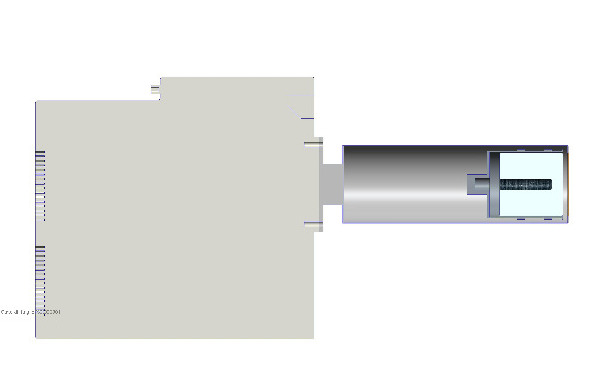
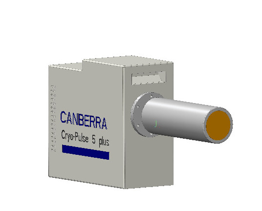
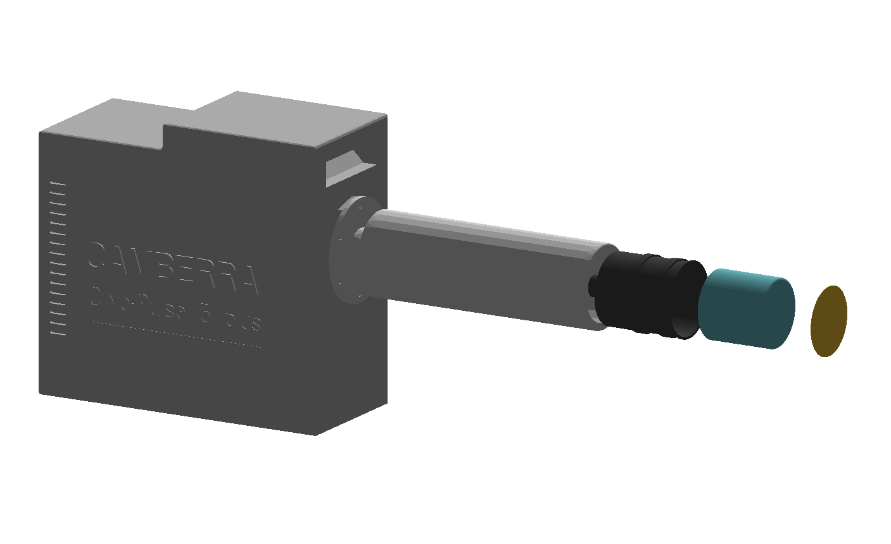

# G4Canberra

A Geant4 implementation of the Mirion Canberra ReGe Detector + Cryo Pulse 5 Cooler.

## Detector Implementation
The Detector geometry was reconstructed using a CAD software starting from the following resources:
1. Cryo Pulse 5 Datasheet [here](docs/cryo-pulse_5_plus_spec_sheet.pdf).
2. HPGe ReGe Detector Geometry Datasheet.

Below are shown two views of the detector assembly.
<figure>

<figcaption>
 &emsp;&emsp;&emsp;&emsp;(a) Side view &emsp;&emsp;&emsp;&emsp;&emsp;&emsp;&emsp;&emsp;&emsp;&emsp;&emsp;&emsp;&emsp;&emsp;&emsp;&emsp;(b) Front View
</figcaption>
</figure>

The conversion from ASCII STL format (inside Geometry/CanberraHPGe) to GDML is performed using the [CADMesh](https://github.com/christopherpoole/CADMesh) Library.

<figure>

<figcaption>
&emsp; Exploded view of GDML implementation
</figcaption>
</figure>

